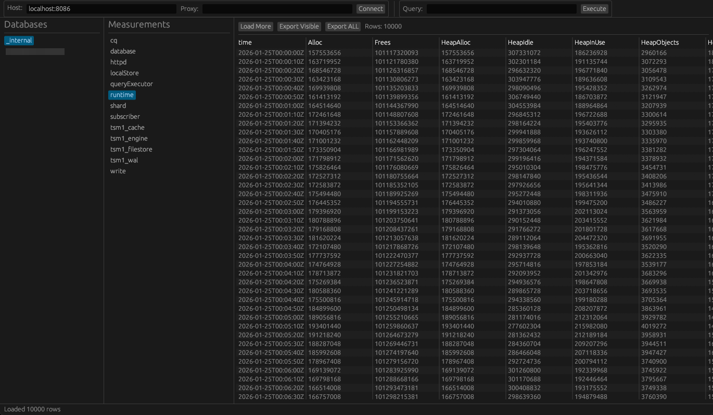

# InfluxDB Browser

Simple GUI for browsing and managing InfluxDB databases on Windows (works on Linux/Mac too).



## Why?

Couldnt find any InfluxDB admin tools for Windows, so i built one for me and whoever else. Im rn learning Rust, soo..

## What it does

- Connect to your InfluxDB instance (supports proxy if needed)
- Browse databases and measurements
- Run custom queries
- View results in a nice table
- Export data to CSV (visible rows or full dataset)
- Handles large datasets with chunked loading

## Tech stack

- **Rust** 
- **egui** - for the GUI (simple and clean)
- **tokio** - async runtime
- **reqwest** - HTTP client for InfluxDB API calls

## How to use

1. Enter your InfluxDB host (e.g., `localhost:8086`)
2. Optional: add a proxy if you need one
3. Hit **Connect**
4. Pick a database → pick a measurement → see your data
5. Run custom queries or export to CSV

## Features

- Clean, straightforward interface
- Lazy loading for big datasets (10k rows at a time)
- Export options: visible data or full table
- Custom query support

## Building

### Windows (exe)
```bash
cargo build --release
```
The executable will be in `target/release/influxdb-browser.exe`

### Linux
```bash
cargo build --release
```
Binary will be in `target/release/influxdb-browser`

### Dependencies
Make sure you have Rust installed: https://rustup.rs/

---

made by vyn with <3